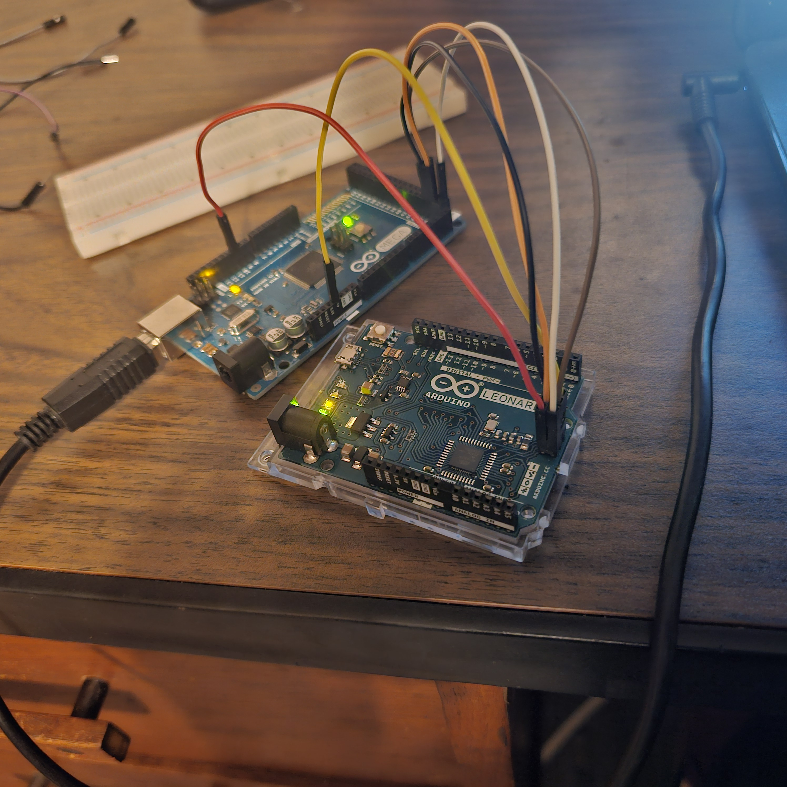

# Firmware Extraction Using Arduino as ISP  
## Embedded Systems Lab – Firmware Extraction & Toolchain Overview

---

## Objective

## Wiring Diagram



The objective of this lab is to extract (read) firmware from one Arduino board using another Arduino configured as an ISP (In-System Programmer).

This lab demonstrates:

- Low-level AVR programming via SPI
- How Arduino can function as a hardware programmer
- How firmware is stored in flash memory
- How firmware protection mechanisms (lock bits) work
- How the AVR toolchain (ArduinoISP + avrdude) operates

---

## Hardware Used

- Programmer: Arduino Mega 2560
- Target: Arduino Leonardo
- Jumper wires
- USB cable
- Host OS: Debian Linux

Target microcontroller:
- ATmega32u4 (on the Leonardo)

---

## Background Concepts

### What is ISP?

In-System Programming (ISP) allows direct access to an AVR microcontroller’s flash memory using SPI.

The required signals:

- MOSI (Master Out Slave In)
- MISO (Master In Slave Out)
- SCK (Serial Clock)
- RESET
- VCC
- GND

ISP bypasses the bootloader and communicates directly with the microcontroller hardware.

---

### What is ArduinoISP?

ArduinoISP is a sketch that turns an Arduino into a programmer.

It:
1. Receives commands from the host computer over USB serial.
2. Converts them into SPI signals.
3. Communicates directly with the target AVR chip.

---

### What is avrdude?

`avrdude` is a command-line utility used to:

- Read flash memory
- Write flash memory
- Read EEPROM
- Read fuse bits
- Read lock bits

It is the same tool used internally by the Arduino IDE.

---

## System Architecture

Computer  
→ USB  
→ Arduino Mega (running ArduinoISP)  
→ SPI (MOSI, MISO, SCK, RESET)  
→ Arduino Leonardo (target)

---

## Wiring Configuration

Mega → Leonardo connections:

| Mega Pin        | Leonardo Pin (ICSP) |
|-----------------|---------------------|
| D51 (MOSI)      | MOSI                |
| D50 (MISO)      | MISO                |
| D52 (SCK)       | SCK                 |
| D10             | RESET               |
| 5V              | VCC                 |
| GND             | GND                 |

Important:
- SPI must connect to the Leonardo ICSP header (not digital pins).
- RESET must be controlled from Mega D10.
- Ground must be shared.

---

## Procedure

### Step 1 – Upload ArduinoISP

On the Mega:

File → Examples → 11.ArduinoISP → ArduinoISP  
Upload to Mega.

---

### Step 2 – Install Toolchain (Debian)

```bash
sudo apt update
sudo apt install avrdude
